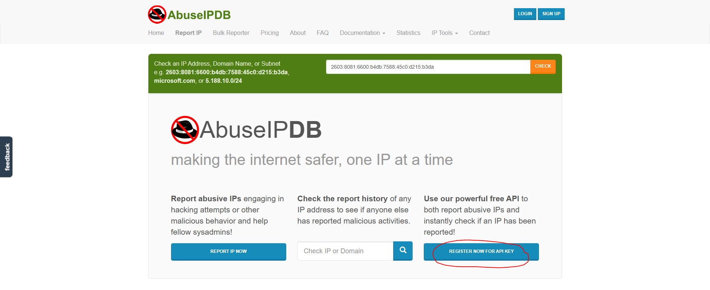
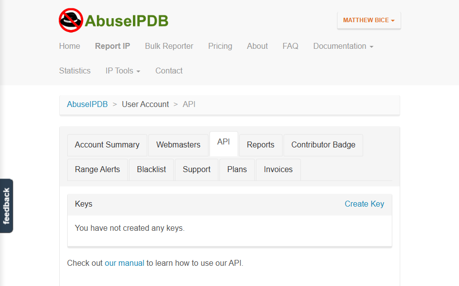
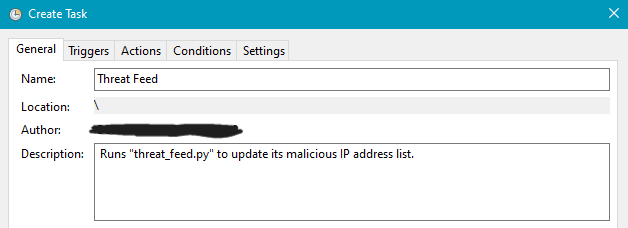
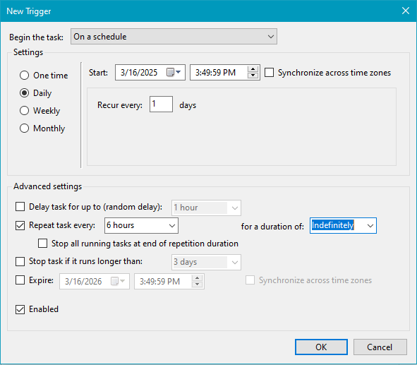
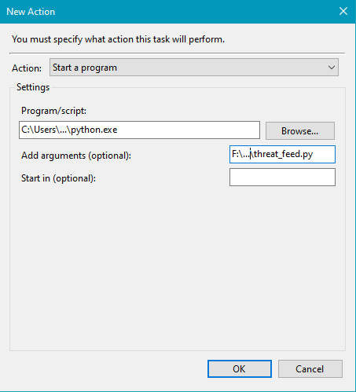

# Introduction

Thinking back to my SIEM from earlier, I configured it so that it would create an alert when it detects a successful RDP login. Now that is only one form of attack it can detect from a whole plethora of cyber attacks. Theoretically, I can make my SIEM "smarter" by configuring it to detect nearly every form of cyber attack under the digital sun. That could work, but in a real-world setting, this idea is way too time-consuming and resource-intensive. More than that, it would put you behind the attackers. Creating rules for known cyber attacks is purely reactive behavior. To make our security posture as effective as possible, we want to create a real-time data stream that informs our security tools about indicators of malicious behavior such as unusual domains, malware signatures, or IP addressess associated with known threat actors (CrowdStrike). This is where threat intelligence feeds come in. Rather than purely being on the defensive, we can be proactive and detect potential threats before they arise while minimizing effort on the user's part. In this lab, I will be creating a simple threat intelligence feed that collects known malicious IP addresses and displays them in an easy-to-read format.

# Setting Up the Tools

This threat intelligence feed will be fairly barebones, but still nonetheless effective at what it is meant to do. For this lab, I only need three things: Python, VS Code, and an API key from AbuseIPDB. For reference, AbuseIPDB is a community-based IP blacklist database where users can report IP addresses that they deem malicious (Mindflow). This will help us enourmously as we will be pulling from this database to determine our malicious IP addresses. This data, in turn, can be fed to our cybersecurity tools so they will quickly know what to flag. Python and VS Code are already installed on my computer, but I can demonstrate how to obtain a free API key from AbuseIPDB.

- _Figure 1_: The homepage for AbuseIPDB. Our point of interest is registering for an API key.

<p align="center">
  
</p>

After entering my information and creating my account, I can now go to the "API" tab and create my key.

- _Figure 2_: The user account homepage with the API tab open.

<p align="center">
  
</p>

For this lab, I will keep my key name simple. The name "ThreatFeedProject" will do. Upon clicking "Create", my API key is generated. Now that I have everything I need, I can now open VS Code and begin my Python program.

# Creating the Python File

With my API key, I can now use my program to pull information from AbuseIPDB's database. Recalling that my goal here is to collect known malicious IP addresses and display them, I know that my program should do the following: Connect with AbuseIPDB, pull a list of malicious IP addresses, and display them in a formatted manner. First I will provide my code, then I will give a line-by-line breakdown. Here is the first draft of my code:

```js

import requests

API_KEY = "my_abuseipdb_api_key"
URL = "https://api.abuseipdb.com/api/v2/blacklist"

headers = {
    "Accept": "application/json",
    "Key": API_KEY
}

response = requests.get(URL, headers=headers)
data = response.json()

# Print the first 10 malicious IPs

print("🔴 Malicious IPs Found:")
for ip in data ['data'][:10]: # Limit to 10 results
    print(f"{ip['ipAddress']} - Confidence Score : {ip['abuseConfidenceScore']}")

```

We begin with "import requests." This line tells Python to link to the "requests" module. This is so we can send API requests to AbuseIPDB. 

Next we define two variables. The first one is the API key I obtained from AbuseIPDB. Now my actual key is much longer and more complex, but for the purpose of this report (and to not give away my API key), I have replaced the actual key with "my_abuseipdb_api_key". This key is important because it is what authorizes my program to access AbuseIPDB. The second variable is "URL" which stores the AbuseIPDB API URL for checking an IP. We use this variable as a pointer so that when we plug it into a function, the variable can tell the function where to find the data.

Next we define a dictionary named "headers". In our program, we are communicating with AbuseIPDB via HTTPS, which is facilitated through HTTPS headers. Therefore, our "headers' dictionary formats our API requests so that they are readable via HTTPS and we can define what we want in the API request. In this case, the "Accept: "application/json" key-value pair specifies that we want our data in JSON format, and the "Key: API_KEY" key-value pair authenticates our request with my API key. This dictionary is what we will use to build the header of our HTTPS API request.

We have our header sorted out, but now we need to build the request line of the HTTPS request. Here, we need to specify the method of our HTTPS request. In this case, we are trying to retrive data from AbuseIPDB, so we will use the GET method. Our request will use the "requests.get()" function with our "URL" variable specifying the API endpoint URL, and our "headers" dictionary specifying the values for the HTTPS API request header. What we receive from this request is stored in the "response" variable. The next variable, "data", takes our "response" and parses its raw JSON format into a Python dictionary that we can use.

With all this combined, our full HTTPS API request looks like this:

- Request Line
  >
  >GET /api/v2/blacklist HTTP/1.1

- Headers
  > Host: api.abuseipdb.com
  > 
  > Accept: application/json
  > 
  > Key: (my AbuseIPDB API key)
  > 
  > User-Agent: python-requests/2.31.0

All right, now all of this runs and we send our request. AbuseIPDB responds and now we have our data, but we cannot necessarily see it. To prove that this program is working and that it is retrieving data, we will have it print out the results. I imagine the amount of data stored in our "data" variable is quite massive, but to keep it simple, we will only print the first 10 lines. First we will print a sort of header, so we know what the data printing out is for. I simply use the "print" fuction to print "🔴 Malicious IPs Found:". The red circle emoji is merely for visual emphasis.

Now for the actual body of our printed message. We are only interested in the first 10 IP addresses retrieved from AbuseIPDB. We can do so using a "for" loop and specifying it to iterate 10 times. We initiate our "for" loop with the keyword "for", then define our iteration variable, "ip", then specify our target for iteration, which is our "data" variable. From our "data" variable, we want the key "data" that is returned from AbuseIPDB's response. This "data" key holds a list of dictionaries with each one representing an IP report. Now from that key, we want to print the data so that it is formatted like so:

> (IP address) - Confidence Score : (AbuseIPDB's confidence score)

To do so, we will pull the values of AbuseIPDB's "ipAddress" and "abuseConfidenceScore" keys and plug them into our formatted message. We do this 10 times, then we have our list of malicious IP addresses and their confidence scores.

Once we run the code, our final output looks like this:

> 🔴 Malicious IPs Found:
> 
> 87.120.93.11 - Confidence Score : 100
> 
> 134.209.151.205 - Confidence Score : 100
> 
> 125.229.136.194 - Confidence Score : 100
> 
> 68.178.145.83 - Confidence Score : 100
> 
> 104.199.151.189 - Confidence Score : 100
> 
> 209.38.226.20 - Confidence Score : 100
> 
> 185.156.73.222 - Confidence Score : 100
> 
> 196.251.91.8 - Confidence Score : 100
> 
> 185.255.91.164 - Confidence Score : 100
> 
> 47.236.174.218 - Confidence Score : 100

This output proves that our threat intelligence feed works! We now have a working program that can supply up-to-date information about malicious IP addresses.

# Applying Automation

We now have a reliable program that, once run, retrives the current list of known malicious IP addresses from AbuseIPDB and prints the first 10 lines to prove that it is working. This is a good start, but now we also have to consider how often AbuseIPDB gets updated. Nearly every time I have repeated this program, a new list of IP addresses appears. This means that new malicious IP addresses are constantly emerging. Now we have to consider: If we want to update our threat intelligence feed, we manually have to open the program and run it each time. This is doable, but can still take up valuable time and resources. Using task scheduler, we can automate our program to run itself after a specified amount of time.

Suppose I want my program to run by itself every six hours. Since I am using a Windows computer, I can open Task Scheduler and create a new task.

- _Figure 3_: The task creation window of Windows Task Scheduler. I have given my new task a name and a description.

<p align="center">
  
</p>

Next I need to specify my task's trigger. In this case, I want my program to run every six hours.

- _Figure 4_: Task Scheduler's trigger creation window. I have set it to recur daily every six hours, and for this to happen indefinitely.

<p align="center">
  
</p>

Lastly, I need to specify what is happening when this task executes. I want it to start a program, Python, and specifically run my Python script.

- _Figure 5_: Task Scheduler's new action creation window. I have specified the paths to both Python.exe and my Python script (note: For this figure, I have hidden their true file paths).

<p align="center">
  
</p>

With all this in place, I select "Finish" and now my task is created and scheduled. My threat intelligence feed can receive an updated list of known malicious IP addresses from AbuseIPDB every six hours. I do not think this is quite on par with professionally-made intelligence feeds, but it is a good start!

# Conclusion

This is a pretty barebones threat intelligence feed, but I believe it is still good at what it does. It retrives the latest list of known malicious IP addresses from AbuseIPDB and stores them for use. I can also consider the implications beyond this lab. Thinking back to my SIEM in Azure, I can link this threat intelligence feed to it which can significantly enhance its security operations. Now, in addition to detecting RDP logins, it can also be on the lookout for malicious IP addresses, which is a major element to cyber attacks. Moreover, with the automation, we can keep our threat intelligence feed up-to-date so that it stays aware of new threats as often as we need it to be. This methodology is what the most effective security tools use and how cyber defenders stay on top of threats and catch them before they even emerge.

## Resources

[CrowdStrike](https://www.crowdstrike.com/en-us/cybersecurity-101/threat-intelligence/threat-intelligence-feeds/)

[Mindflow](https://mindflow.io/integrations/abuseipdb)

[AbuseIPDB](https://www.abuseipdb.com)

